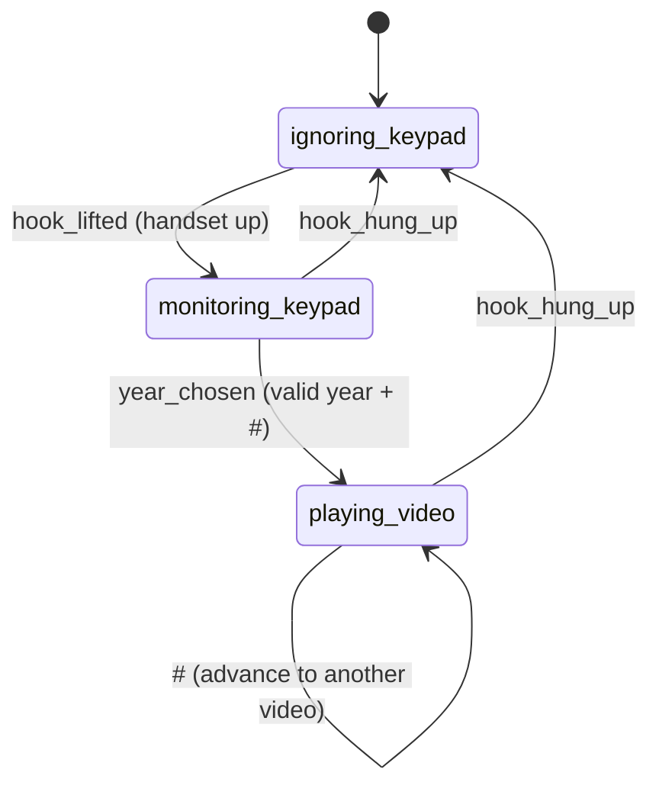

# Teletube Architecture

Teletube turns a payphone into a video player. Lifting the handset lets the
user dial a four-digit year on the keypad; pressing `#` plays a random video
from that year on the attached screen. Hanging up stops playback and returns
the phone to its idle "pick me up" prompt.

This document describes how the software is structured, the messages the
components exchange, and the state machine and behaviors that drive the
experience.

> Keep this document up to date when components, topics, messages, states, or
> behaviors change.

---

## 1. High-level design

The software is a set of small, independent processes that communicate over a
local **publish/subscribe message bus**. No process calls another directly;
they only exchange messages through a central broker. This keeps each concern
(input, output, playback) isolated and independently restartable.

```
                         ┌───────────────────────────┐
                         │          Broker            │
                         │  ZeroMQ XSUB/XPUB proxy     │
                         │  pub tcp://127.0.0.1:5559   │
                         │  sub tcp://127.0.0.1:5560   │
                         └─────────────┬─────────────┘
                                       │  (all topics flow through here)
       ┌──────────────┬───────────────┼───────────────┬──────────────┐
       │              │               │               │              │
┌──────┴──────┐ ┌─────┴──────┐ ┌──────┴───────┐ ┌─────┴────────┐     │
│ hook_monitor│ │keypad_     │ │display_      │ │video_player_ │     │
│             │ │monitor     │ │monitor       │ │app           │     │
│ reads hook  │ │reads keypad│ │draws screen  │ │plays videos  │     │
│ switch      │ │+ speaks    │ │              │ │with mpv      │     │
└──────┬──────┘ └─────┬──────┘ └──────┬───────┘ └─────┬────────┘     │
       │              │               │               │              │
   ┌───┴───┐    ┌─────┴─────┐    ┌────┴────┐    ┌──────┴──────┐       │
   │ Hook  │    │  Keypad   │    │ Display │    │ VideoPlayer │       │
   │ (GPIO)│    │  (GPIO)   │    │ (fb0)   │    │ (mpv)       │       │
   └───────┘    │  Dtmf/    │    └─────────┘    └─────────────┘       │
                │  Speech   │                                         │
                │  (audio)  │                                         │
                └───────────┘                                         │
                                                                      │
                                          (monitor.py — diagnostic ───┘
                                           subscriber, not a service)
```

Not shown above: **ringer_monitor** also subscribes to the hook topic and
drives a **Ringer** (PWM bell on GPIO), ringing the phone when it has been left
hung up.

### Directory layout

```
app/src/
├── apps/                      # runnable processes (one main() each)
│   ├── broker.py              # starts the message broker
│   ├── hook_monitor.py        # publishes handset lifted/hung-up state
│   ├── keypad_monitor.py      # reads keypad, runs the interaction state machine
│   ├── display_monitor.py     # renders idle/entry prompts to the screen
│   ├── video_player_app.py    # plays and controls videos
│   ├── ringer_monitor.py      # rings the bell when left hung up
│   ├── monitor.py             # diagnostic: prints all messages (manual only)
│   ├── publisher.py           # diagnostic: publish a message to a topic (manual only)
│   └── message_topics.py      # Topic enum + message dataclasses (the contract)
├── devices/                   # hardware/output abstractions
│   ├── hook.py                # Hook: reads the hook switch GPIO
│   ├── keypad.py              # Keypad: scans the 4x3 keypad GPIO
│   ├── display.py             # Display: draws to the framebuffer via Pillow
│   ├── ringer.py              # Ringer: PWM bell warble on a GPIO pin
│   └── video_player.py        # VideoPlayer: launches/controls mpv
├── sound/                     # audio output
│   ├── dtmf.py                # DtmfPlayer: keypad tones
│   ├── speech.py              # text-to-speech (Piper), with a disk cache
│   ├── voices/                # Piper voice model
│   └── speech_cache/          # precomputed speech clips (.npz)
└── messaging/                 # the pub/sub layer
    ├── broker.py              # Broker (XSUB/XPUB proxy) + endpoints
    ├── publisher.py           # Publisher (send dataclass messages by topic)
    └── subscriber.py          # Subscriber (receive + decode by topic)
```

---

## 2. The message bus

### Broker

`messaging/broker.py` runs a ZeroMQ **XSUB/XPUB proxy** in `apps/broker.py`:

- Publishers connect to `tcp://127.0.0.1:5559` and send.
- Subscribers connect to `tcp://127.0.0.1:5560` and receive.
- The proxy relays every published message to all matching subscribers.

Clients never reference the `Broker` class — they just create `Publisher` and
`Subscriber` objects, which know the endpoints.

### Publisher / Subscriber

- **`Publisher(topic)`** — sends dataclass messages on a fixed topic. Each
  message is JSON-encoded (`dataclasses.asdict` → JSON). The publisher applies
  a short connect delay so its socket is ready before the first send.
- **`Subscriber(topic, message_type)`** — receives messages on a topic and
  decodes the JSON back into the given dataclass. With no `message_type`,
  `receive()` returns a plain `dict` (used by the diagnostic `monitor.py`).

### Slow-joiner handling

ZeroMQ pub/sub has a "slow joiner" window: a message published before a
subscriber has finished connecting is lost. Because `hook_monitor` publishes
the current hook state and other apps react to it, the initial state could be
missed at startup. Two mechanisms address this:

1. **`hook_monitor` heartbeat** — it re-announces the current hook state every
   second, so any late-joining subscriber catches up within ~1s.
2. **Idempotent consumers** — consumers act only on *changes* of state, so the
   repeated heartbeats are harmless (see `display_monitor` and the keypad hook
   listener).

At boot, systemd also orders the state-producing service after the consumers
(see `app/systemd/README.md`).

---

## 3. Topics and messages

Defined in `apps/message_topics.py`. This is the contract between processes.

| Topic (`Topic.`) | Value | Publisher(s) | Subscriber(s) | Message |
|------------------|-------|--------------|---------------|---------|
| `PHONE_HOOK` | `phone_hook` | hook_monitor | keypad_monitor, display_monitor, video_player_app, ringer_monitor | `HookMessage` |
| `KEYPAD` | `keypad` | keypad_monitor | video_player_app | `KeypadMessage` |
| `DISPLAY` | `display` | keypad_monitor | display_monitor | `DisplayMessage` |
| `PLAYBACK` | `playback` | keypad_monitor | video_player_app | `PlaybackMessage` |

### Message payloads

```python
@dataclass
class HookMessage:
    state: str            # "lifted" or "hung_up"

@dataclass
class KeypadMessage:
    year_entered: str     # e.g. "1976"

@dataclass
class DisplayMessage:
    text: str = ""        # text to show; "" clears the screen; \n splits lines
    size: int | None = None   # font size in points; None = display default (96)

@dataclass
class PlaybackMessage:
    command: str          # "hint": briefly interrupt the video to show a hint
    text: str = ""        # for "hint": the chosen year, named in the hint
    duration: float = 3.0 # for "hint": seconds to show the hint
```

---

## 4. Components

### hook_monitor (`apps/hook_monitor.py`)

Polls the hook switch (`devices/hook.py`, GPIO 12) every 50 ms.

- On startup, and whenever the state changes, publishes `HookMessage("lifted")`
  or `HookMessage("hung_up")` on `PHONE_HOOK`.
- Re-announces the current state every second (heartbeat, see §2).

It is the single source of truth for whether the handset is up or down.

### keypad_monitor (`apps/keypad_monitor.py`)

The heart of the interaction. Scans the 4x3 keypad (`devices/keypad.py`), plays
DTMF tones (`sound/dtmf.py`) and spoken prompts (`sound/speech.py`), publishes
year selections, and drives the screen and playback via messages. Its behavior
is a state machine — see §5.

At startup it reads the available year range from `VideoPlayer.year_range()`
and precomputes all spoken prompts (range prompt, per-year "you chose" and
"no videos" clips) into the speech cache.

### display_monitor (`apps/display_monitor.py`)

Owns the screen (`devices/display.py`, framebuffer `/dev/fb0`). Two inputs:

- **`PHONE_HOOK`** (main thread): on `hung_up`, blinks `← Pick Me Up!` once per
  half second; on `lifted`, stops blinking and clears the screen. Reacts only
  to state *changes* to ignore hook heartbeats.
- **`DISPLAY`** (background thread): renders any `DisplayMessage` — arbitrary
  centred text (newlines split lines), at an optional font size, or clears the
  screen on blank text. This overrides the blinking prompt.

The physical panel is portrait (480×800); the display draws landscape (800×480)
and rotates 90°, matching the video orientation.

`display_monitor` owns the screen for prompts and idle/entry states.
`video_player_app` writes to the framebuffer directly (its own `Display`) only
for the brief video hint, while it has stopped mpv — so the two never draw at
the same time.

### video_player_app (`apps/video_player_app.py`)

Owns video playback (`devices/video_player.py`, `mpv`). Threads:

- **main**: on each `KeypadMessage`, starts playing a random `.mp4` from that
  year's directory (returns immediately; see the non-blocking note below).
- **hook_listener**: on `HookMessage("hung_up")`, stops playback.
- **playback_listener**: on `PlaybackMessage(command="hint")`, briefly
  interrupts the video to show a hint (see §5 for why this stops the video
  rather than overlaying it).

Playback is **non-blocking**: `VideoPlayer` runs mpv on its own background
thread, so a new year (including the `#`-advance) supersedes the current video
immediately instead of waiting for it to finish. Each play bumps a generation
counter; the superseded mpv is terminated and its thread exits.

Videos live under `/home/pi/teletube-downloader/data/videos/ready/<year>/`.

### ringer_monitor (`apps/ringer_monitor.py`)

Rings the phone when it has been left hung up, so it eventually calls for
attention. It subscribes to `PHONE_HOOK` (via a background listener thread that
tracks the current hook state) and drives a **Ringer** (`devices/ringer.py`).

Behavior:

- When the handset has been on-hook (hung up) continuously for `RING_DELAY`
  (300 s), it rings for up to `RING_DURATION` (30 s), stopping early the moment
  the handset is lifted.
- Any lift resets the delay; re-hanging-up restarts the countdown. If the
  handset is still hung up after a ring, the cycle repeats.
- At startup the delay begins counting as though the handset had just been hung
  up.

The **Ringer** produces a telephone-bell "warble" by alternating a PWM output
between two frequencies (400/450 Hz) on its GPIO pin; `start_ringing()` /
`stop_ringing()` run the ring cadence in the background. It uses `RPi.GPIO`
(for PWM), unlike the other GPIO devices which use `lgpio`.

### monitor (`apps/monitor.py`)

A manual diagnostic that subscribes to everything and prints each message. Not
a service; run by hand (see the top-level README).

---

## 5. Keypad interaction state machine

Implemented with `python-statemachine` in `keypad_monitor.py`
(`KeypadStateMachine`). It has three states.

| State | Meaning | Keypad scanned? |
|-------|---------|-----------------|
| `ignoring_keypad` | Handset on-hook (idle). Initial state. | No |
| `monitoring_keypad` | Handset lifted; user entering a year. | Yes |
| `playing_video` | A year was chosen; a video was requested/playing. | Yes |

### Transitions

| Transition | From → To | Trigger |
|------------|-----------|---------|
| `hook_lifted` | `ignoring_keypad` → `monitoring_keypad` | `HookMessage("lifted")` |
| `year_chosen` | `monitoring_keypad` → `playing_video` | valid year confirmed with `#` |
| `hook_hung_up` | `monitoring_keypad` → `ignoring_keypad` | `HookMessage("hung_up")` |
| `hook_hung_up` | `playing_video` → `ignoring_keypad` | `HookMessage("hung_up")` |

Transitions triggered by the hook are driven by a background `hook_listener`
thread; `year_chosen` is triggered from key processing on the main loop.



### Behavior in `ignoring_keypad`

- Keypad is not scanned.
- On entry: stops any speech/DTMF, clears the entry buffer and selected year.
- The screen is owned by `display_monitor`, which blinks `← Pick Me Up!`.

### Behavior in `monitoring_keypad` (entering a year)

On entry: shows the three-line prompt on screen and starts a spoken-prompt loop
that repeats the year-range prompt every ~7s until the first key is pressed.

Screen prompt:

```
ENTER A YEAR
<min>-<max>
THEN PRESS #
```

Key handling (`_handle_key_while_entering`):

- **Digit (0–9)** — appended to the buffer; the accumulated digits are shown on
  screen in place of the prompt. A DTMF tone plays while the key is held.
- **5th digit** — rejected: buffer cleared, prompt restored, "too many digits"
  spoken.
- **`*`** — clears the buffer; restores the prompt and speaks "input cleared".
- **`#`** — validate the buffer:
  - Not 4 digits / outside `min..max` → reject, re-prompt.
  - In range but the year has no videos → show `Sorry! No Videos Available for
    <year>` for 5 seconds, speak the same, then resume entry.
  - Valid with videos → remember the year, speak "you chose <year>", publish
    `KeypadMessage(year_entered=year)`, and transition to `playing_video`.

### Behavior in `playing_video`

`video_player_app` has started a video for the chosen year. Key handling
(`_handle_key_while_playing`):

- **`#`** — advance: re-publish `KeypadMessage(year_entered=selected_year)`.
  Because playback is non-blocking, `video_player_app` picks up the new message
  immediately, stops the current video, and starts another random one from the
  same year.
- **Any other key** — momentarily show a hint, then resume the video where it
  left off, by publishing `PlaybackMessage(command="hint", text=selected_year,
  duration=5.0)`. `video_player_app`:
  1. Reads mpv's current playback position.
  2. Stops mpv — this frees the DRM display plane.
  3. Draws the hint on the framebuffer via `Display` (bright green, correctly
     rotated), e.g. `PRESS # / for another video / from <year>`.
  4. After the duration, relaunches the same video from the saved position
     (`mpv --start=+<pos>`).

  The hint is drawn on the **framebuffer**, and the video must be **stopped**
  (not paused) while it shows. mpv owns the DRM display plane while running, so
  anything written to `/dev/fb0` is hidden behind it; pausing does not release
  the plane, and mpv's own OSD does not reliably render rotated text over live
  video. Stopping mpv releases the plane so the framebuffer hint (which already
  renders rotated text for every other prompt) is visible, then playback
  resumes from the saved offset.

---

## 6. Audio

- **DTMF** (`sound/dtmf.py`) — `DtmfPlayer` plays the correct dual-tone for a
  held key via `sounddevice`, on its own audio stream.
- **Speech** (`sound/speech.py`) — Piper text-to-speech played via
  `sounddevice`. Clips are keyed by name and cached to `sound/speech_cache/` as
  `.npz`, so they are synthesized once and replayed instantly thereafter.
  `keypad_monitor` precomputes all its prompts at startup. Message keys are
  namespaced by app (e.g. `keypad_monitor.prompt`, `keypad_monitor.chose_2016`).

DTMF and speech use independent audio streams; playing one does not stop the
other. Speech playback is non-blocking (`sd.play`), and `speech.stop()` halts
whatever speech is currently playing.

- **Ringer** (`devices/ringer.py`) — the telephone bell is a separate output,
  not part of the sounddevice audio path: it is a PWM square-wave "warble" on a
  GPIO pin (see ringer_monitor in §4), driven with `RPi.GPIO`.

---

## 7. End-to-end scenarios

### Idle → play a video

1. Handset down. `hook_monitor` publishes `hung_up`; `display_monitor` blinks
   `← Pick Me Up!`. keypad_monitor is in `ignoring_keypad`.
2. User lifts the handset → `hook_lifted` → `monitoring_keypad`. Screen shows
   the `ENTER A YEAR` prompt; the spoken prompt begins.
3. User types `1 9 7 6` (tones play, digits shown), presses `#`.
4. Year is valid and has videos → keypad speaks "you chose nineteen
   seventy-six", publishes `KeypadMessage("1976")`, enters `playing_video`.
5. `video_player_app` plays a random 1976 video full-screen.

### Advance to another video

6. While playing, user presses `#` → keypad re-publishes `KeypadMessage("1976")`
   → `video_player_app` stops the current video and starts another 1976 one.

### Peek at the hint

7. While playing, user presses any other key → the video stops, the framebuffer
   shows `PRESS # / for another video / from 1976` (green, rotated) for 5
   seconds, then the same video resumes from where it left off.

### Hang up

8. User hangs up → `hook_monitor` publishes `hung_up` → `video_player_app`
   stops the video; keypad_monitor returns to `ignoring_keypad`;
   `display_monitor` resumes the blinking prompt.

### Year with no videos

- At step 4, if the chosen year has no videos, the screen shows `Sorry! No
  Videos Available for <year>` for 5 seconds (with matching speech) and then
  returns to the entry prompt, staying in `monitoring_keypad`.

---

## 8. Deployment

In production the apps run as systemd services grouped under a target, with
startup ordered so the screen stays blank until everything is ready. See
[`app/systemd/README.md`](app/systemd/README.md). During development the apps
can be launched together with `app/start.sh` / `app/stop.sh`.
